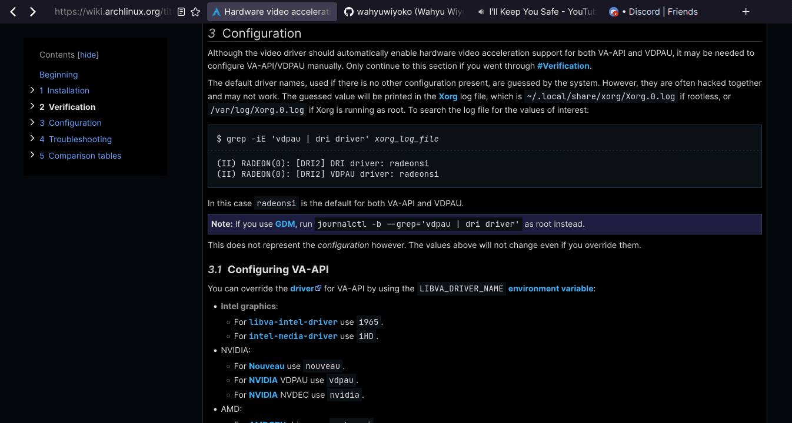
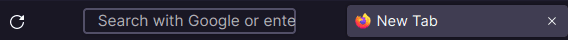
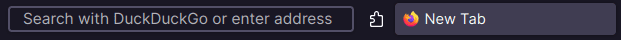

# SiMiFox

A simple and minimal Firefox custom configurations to enhance privacy,
security, performance, and UI simplicity.




## Usage

1. Download or clone the repository:

```
git clone https://github.com/wahyuwiyoko/simifox.git
```

2. Copy the `user.js` file and `chrome` directory from `simifox` directory
to your Firefox profile directory.

For Windows, is located at
`C:\Users\your-username\AppData\Roaming\Mozilla\Firefox\Profiles\your-firefox-profile`

For Mac, is located at
`/Users/your-username/Library/Application Support/Firefox/Profiles/your-firefox-profile`

For Linux, is located at
`/home/your-username/.mozilla/firefox/your-firefox-profile`

Replace `your-firefox-profile` with the correct Firefox profile name.
Usually it's eight random characters with the name of the profile.
For example: `/home/john/.mozilla/firefox/eh3dq93f.simifox`

3. Restart Firefox to apply the configurations.

## Tips

If you start with a new Firefox profile and use this custom configuration,
you may be having a wasted space between the search bar by default like these:



To remove the "flexible space", right click on the top bar, `Customize Toolbar...`,
drag and drop the `Flexible Space` and `Reload` icon to the "overflow menu",
and `Done`.

You will have _compact-like_ search bar like these:



## Keyboard Shortcuts

You can see the full list of Firefox keyboard shortcuts at their
[website](https://support.mozilla.org/en-US/kb/keyboard-shortcuts-perform-firefox-tasks-quickly).

And here are the useful shortcuts that I mostly used:

- Open a new tab: `Ctrl+t`
- Close the current tab: `Ctrl+w`
- Undo close tab: `Ctrl+Shift+t`
- Focus address bar: `Ctrl+l`
- Reload page: `Ctrl+r`
- Reload page (override cache): `Ctrl+Shift+r`
- Stop page: `Escape`
- Find in page: `Ctrl+f`
- New private window: `Ctrl+Shift+p`
- Library window (history): `Ctrl+Shift+H`
- Bookmark URL: `Ctrl+d`
- Show/hide the bookmarks toolbar: `Ctrl+Shift+b`
- Show all bookmarks (library window): `Ctrl+Shift+o`
- View site information: `Ctrl+i`
- Toggle developer tools: `Ctrl+Shift+i`
- View add-ons and settings: `Ctrl+Shift+a`

## Privacy Suggestions

- Change default search engine to DuckDuckGo.
- Use [uBlock Origin](https://addons.mozilla.org/en-US/firefox/addon/ublock-origin/)
  and [DuckDuckGo](https://addons.mozilla.org/en-US/firefox/addon/duckduckgo-for-firefox/)
  extension.
- Use local password manager such as [pass](https://www.passwordstore.org/)
  instead of built-in password manager in browser.

## Known Issues

- Some pop-up bar like DRM, bookmark menu, and maybe other things that
  beside the search bar had a weird placement. I think it's a bit tricky to
  show them and debug using `order` and calculate the `width` property inside
  media query.

- Search bar on Windows are overlapping at right side, causing the bookmark
  icon and any other toolbar icon become hidden.

## Debugging

If you want to debug the Firefox style or want to customize your own Firefox
style, you can follow these step:

1. Press `Ctrl+Shift+i` or right click and `inspect` to show the developer tools.
2. Click the three dots at the right side of developer tools window and go to
   `Settings`.
3. At the `Advanced settings` option, checkmark the `Enable browser chrome and
   add-on debugging toolboxes` and `Enable remote debugging`.
4. Close the developer tools window and press `Ctrl+Shift+Alt+i`.
5. If it prompt the `Incoming Connection` window, click `OK` to allow remote
   debugging.
6. Now you can inspect every top bar element such as navigation bar and tab bar.
   You can also save every changes inside `Style Editor` and select the
   `userChrome.css`.

## Special Thanks

- [yokoffing](https://github.com/yokoffing)
- [Eric Murphy](https://github.com/ericmurphyxyz)
- [Rosé Pine](https://rosepinetheme.com/)
